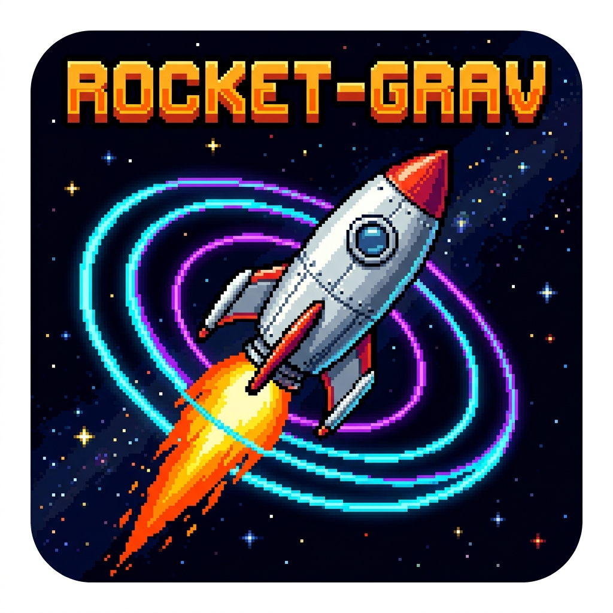
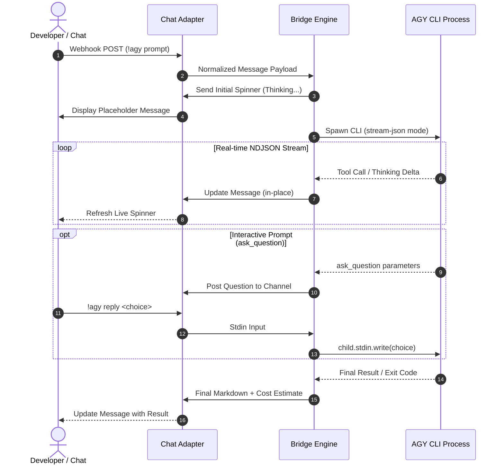

# <p align="center"></p>

```text
  ██████╗  ██████╗  ██████╗██╗  ██╗███████╗████████╗      ██████╗ ██████╗  █████╗ ██╗   ██╗
  ██╔══██╗██╔═══██╗██╔════╝██║ ██╔╝██╔════╝╚══██╔══╝     ██╔════╝ ██╔══██╗██╔══██╗██║   ██║
  ██████╔╝██║   ██║██║     █████═╝ █████╗     ██║   █████╗██║  ███╗██████╔╝███████║██║   ██║
  ██╔══██╗██║   ██║██║     ██╔═██╗ ██╔══╝     ██║   ╚════╝██║   ██║██╔══██╗██╔══██║╚██╗ ██╔╝
  ██║  ██║╚██████╔╝╚██████╗██║ ╚██╗███████╗   ██║         ╚██████╔╝██║  ██║██║  ██║ ╚████╔╝ 
  ╚═╝  ╚═╝ ╚═════╝  ╚═════╝╚═╝  ╚═╝╚══════╝   ╚═╝          ╚═════╝ ╚═╝  ╚═╝╚═╝  ╚═╝  ╚═══╝  
```

<p align="center">
  <strong>Autonomous Antigravity (AGY) Agent Bridge & Chat Gateway</strong><br />
  <em>Pluggable, real-time pair programming for Rocket.Chat, Mattermost, Slack, and beyond.</em>
</p>

<p align="center">
  
  
  
  
  
</p>

---

## [!] Motivation & Why This Was Built

The primary motivation behind building **Rocket-Grav** was to enable seamless access to the **Google Antigravity CLI (`agy`) from anywhere, on any device** (mobile phone, tablet, laptop, or remote workstation through a team chat client) while taking full advantage of an existing **Antigravity AI subscription**.

By bridging chat platforms directly to a containerized Antigravity CLI runtime:

* **Zero Per-Token API Costs:** All core reasoning, file analysis, and autonomous coding workflows utilize your flat Antigravity subscription plan rather than requiring metered commercial API keys or prepaid credits.
* **Device Independence:** Trigger complex refactors, inspect build logs, or fix bugs straight from a mobile chat app without needing terminal access or an open IDE.
* **Asynchronous Automation:** Fire off prompts into dedicated threads and receive structured notifications, live progress updates, and completion reports wherever you are.

---

## ▶ Overview

**Rocket-Grav** is a lightweight, modular gateway service connecting chat webhooks to Google's **Antigravity CLI** (`agy`). It provides an autonomous coding agent (`MangoBot`) accessible from any designated channel or thread.

### Core Capabilities

* • **Modular Chat Adapters:** Built with a pluggable adapter architecture. Switch between **Rocket.Chat**, **Mattermost**, or **Slack** with a single configuration variable (`CHAT_PROVIDER`).
* • **Live Animated Progress:** Updates messages in-place with real-time Braille status spinners (`⠋`, `⠙`, `⠹`...) and tool descriptions (`Running run_command...`, `Thinking...`).
* • **Interactive Stdin Piping:** Intercepts agent interactive questions (`ask_question`) and allows users to reply directly (`!agy reply <choice>`), piping answers into the running process.
* • **On-The-Fly Model Switching:** Switch underlying language models anytime (`!agy model switch claude`, `flash`, `gemini`, `gpt`) to navigate quota limits or optimize reasoning depth.
* • **Isolated Thread Sessions:** Manages multiple conversation threads and contexts independently via `threads.json`.
* • **Automatic Issue Tracking:** Automatically identifies bug/feature requests and registers them in the integrated [Beads](https://github.com/steven-tey/beads) issue tracker (`bd create`).
* • **Auto-Retry Resilience:** Automatically retries failing CLI invocations up to 3 times, surfacing complete JSON trace dumps if hard errors persist.
* • **Asset Server & Cost Tracking:** Tracks visual assets generated during runs and serves them via an embedded static HTTP gallery (`/assets`), calculating GCP API costs when external image generation APIs are invoked.

---

## ▶ Architectural Flow

Rocket-Grav uses a decoupled three-tier architecture: the **Chat Adapter Layer**, the **Core Bridge Engine**, and the **Antigravity Runtime**.

### Communication Flow

```text
 [ Team Chat ]              [ Rocket-Grav Bridge ]             [ AGY Agent Process ]
 (User in Channel)               (Express Server)                  (Container CLI)
        │                               │                                 │
  1.    │ ─── "!agy fix bug" (POST) ───►│                                 │
        │                               │ ─── 2. Quick ACK (HTTP 200) ─── │
        │◄── 3. Post '⠋ Thinking...' ──│                                 │
        │                               │ ─── 4. Spawn 'agy' process ────►│
        │                               │                                 │
        │                               │◄─── 5. Stream JSON event ───────│ (tool: read_file)
  6.    │◄── Update: '⠹ Reading...' ───│                                 │
        │                               │◄─── 7. Stream JSON event ───────│ (tool: ask_question)
  8.    │◄── Post: "Choose option:" ────│                                 │
        │                               │                                 │
  9.    │ ─── "!agy reply 1" (POST) ───►│                                 │
        │                               │ ─── 10. Pipe answer to stdin ──►│ (resumes work)
        │                               │                                 │
        │                               │◄─── 11. Process Exit (Code 0) ──│ (DONE)
 12.    │◄── Final Result / Markdown ───│                                 │
        │                               │                                 │
```

### High-Level Sequence



---

## ▶ Modular Provider Architecture

All chat integrations inherit from the base adapter interface located in `adapters/BaseAdapter.js`:

```text
adapters/
├── BaseAdapter.js           # Abstract interface for chat providers
├── RocketChatAdapter.js     # Rocket.Chat REST API & Webhook implementation
├── MattermostAdapter.js     # Mattermost Posts API implementation
├── SlackAdapter.js          # Slack Events API & Web API implementation
└── index.js                 # Dynamic factory driven by CHAT_PROVIDER
```

To switch platforms, set `CHAT_PROVIDER` in your `.env` file:

```env
CHAT_PROVIDER=rocketchat     # Options: rocketchat | mattermost | slack
```

### Platform Compatibility

| Feature | Rocket.Chat | Mattermost | Slack |
|---|:---:|:---:|:---:|
| **Inbound Webhook** | [✓] Supported | [✓] Supported | [✓] Supported |
| **In-Place Live Spinner** | `chat.update` | `PUT /api/v4/posts` | `chat.update` |
| **Interactive Stdin Reply** | `!agy reply` | `!agy reply` | `!agy reply` |
| **Thread Support** | `tmid` | `root_id` | `thread_ts` |

---

## ▶ Usage Switches & Commands

All commands can be invoked using the `!agy` prefix or `@agy` bot mention.

### 1. General Execution

| Command | Description | Example |
|---|---|---|
| `!agy <prompt>` | Sends a prompt to the agent in the active thread. | `!agy Refactor authentication in server.js` |
| `!agy help` | Shows command reference and active settings. | `!agy help` |

### 2. Issue Tracking (Beads)

Commands starting with issue keywords are automatically registered in the [Beads](https://github.com/steven-tey/beads) issue tracker (`bd create`) before execution begins:

| Command | Description | Example |
|---|---|---|
| `!agy bug <desc>` | Logs a bug under the active thread epic and runs AGY. | `!agy bug Token validation fails on empty header` |
| `!agy feature <desc>` | Logs a feature request and runs AGY. | `!agy feature Add Healthcheck route` |
| `!agy fix <desc>` | Logs a fix task and runs AGY. | `!agy fix Memory leak in event listener` |
| `!agy add <desc>` | Logs an addition task and runs AGY. | `!agy add Unit tests for adapter factory` |
| `!agy issues` / `!agy beads` | Lists all currently open issues in the workspace. | `!agy issues` |

### 3. Interactive Replies

When AGY prompts with `ask_question`:

```text
**AGY has a question:**
*Do you want to run database migrations?*
  1. Yes
  2. No
*(Reply using `!agy reply <your answer>`)*
```

| Command | Description | Example |
|---|---|---|
| `!agy reply <ans>` | Pipes answer directly to the agent process `stdin`. | `!agy reply 1` or `!agy reply yes` |
| `!agy answer <ans>` | Alias for `!agy reply`. | `!agy answer proceed` |

### 4. Model Switching

Dynamically select language models without restarting the container:

| Command | Description | Example |
|---|---|---|
| `!agy model` | Shows the currently active model. | `!agy model` |
| `!agy models` / `!agy model list` | Displays table of all available models and shortcuts. | `!agy models` |
| `!agy model switch <name>` | Switches the model used for subsequent requests. | `!agy model switch claude` |
| `!agy model use <name>` | Alias for `model switch`. | `!agy model use flash` |

#### Model Shortcuts

| Shortcut | Target Model ID | Description |
|---|---|---|
| `default` | *(none)* | Resets to default Antigravity subscription plan |
| `claude` / `opus` | `claude-opus-4-6-thinking` | Claude Opus 4.6 (Thinking enabled) |
| `sonnet` / `claude-sonnet`| `claude-sonnet-4-6` | Claude Sonnet 4.6 |
| `gemini` / `gemini-pro` | `gemini-3.1-pro-low` | Gemini 3.1 Pro (Low reasoning) |
| `gemini-pro-high` | `gemini-3.1-pro-high` | Gemini 3.1 Pro (High reasoning) |
| `flash` | `gemini-3.7-flash-medium` | Gemini 3.7 Flash (Medium reasoning) |
| `flash-high` | `gemini-3.7-flash-high` | Gemini 3.7 Flash (High reasoning) |
| `gpt` | `gpt-oss-120b-medium` | GPT-OSS 120B |
| `<custom-id>` | `<any raw model id>` | Pass any valid model string directly |

### 5. Thread & Context Management

| Command | Description | Example |
|---|---|---|
| `!agy threads` / `!agy thread list` | Lists all threads and marks the active one. | `!agy threads` |
| `!agy thread switch <name>` | Switches to an existing thread or creates a new one. | `!agy thread switch auth-refactor` |

### 6. Diagnostics & Endpoints

* • `!agy log` / `!agy logs`: Tails the last 25 lines of the active thread's `transcript.jsonl`.
* • `POST /webhook`: Inbound webhook endpoint for chat platforms or external automation scripts.
* • `GET /assets`: Static gallery viewer for generated images and assets.

---

## ▶ Docker Setup & Installation

### 1. Prerequisites

* • Docker and Docker Compose (or Portainer / Dockhand).
* • A Google account with Antigravity CLI access.
* • An active instance of Rocket.Chat, Mattermost, or Slack.

### 2. Environment Variables

Configure your `.env` file according to your selected provider:

#### Common Variables

| Variable | Description | Default |
|---|---|---|
| `CHAT_PROVIDER` | Active adapter (`rocketchat`, `mattermost`, `slack`). | `rocketchat` |
| `BOT_NAME` | Bot username / alias displayed in messages. | `MangoBot` |
| `GEMINI_API` | (Optional) Gemini API key for external tooling. | — |
| `GITEA_PAT` | (Optional) Personal access token for Gitea automation. | — |

#### Rocket.Chat Provider (`CHAT_PROVIDER=rocketchat`)

| Variable | Required | Description |
|---|:---:|---|
| `ROCKETCHAT_TOKEN` | Yes | Token configured in Rocket.Chat Outgoing Webhook. |
| `ROCKETCHAT_USER_ID` | Yes | User ID of the bot account. |
| `ROCKETCHAT_PAT` | Yes | Personal Access Token (PAT) for Rocket.Chat REST API. |
| `ROCKETCHAT_URL` | Yes | Full URL of your Rocket.Chat server (e.g. `http://rocketchat.example.com:3000`). |

#### Mattermost Provider (`CHAT_PROVIDER=mattermost`)

| Variable | Required | Description |
|---|:---:|---|
| `MATTERMOST_TOKEN` | Yes | Token from Mattermost Outgoing Webhook integration. |
| `MATTERMOST_PAT` | Yes | Bot Access Token or Personal Access Token for REST API. |
| `MATTERMOST_URL` | Yes | URL of your Mattermost instance (e.g. `http://mattermost:8065`). |

#### Slack Provider (`CHAT_PROVIDER=slack`)

| Variable | Required | Description |
|---|:---:|---|
| `SLACK_BOT_TOKEN` | Yes | Bot User OAuth Token (`xoxb-...`). |
| `SLACK_VERIFICATION_TOKEN`| Yes | Verification token from Slack App settings. |

---

## ▶ Step-by-Step Walkthrough

### Step 1: Clone the Repository

```bash
git clone http://git.example.com:3000/camkerr81/rocket-grav.git
cd rocket-grav
```

### Step 2: Configure `.env`

Create a `.env` file in the root directory:

```env
CHAT_PROVIDER=rocketchat
ROCKETCHAT_TOKEN=your_webhook_token_here
ROCKETCHAT_USER_ID=qW8x9J2kL4mNpQrSt
ROCKETCHAT_PAT=your_personal_access_token
ROCKETCHAT_URL=http://rocketchat.example.com:3000
```

### Step 3: Start the Container

```bash
docker compose up -d --build
```

### Step 4: Perform One-Time Antigravity CLI Authentication

Before the bridge can process autonomous prompts, complete the one-time Google authentication flow inside the container:

```bash
docker exec -it rocketchat-agy-bridge agy
```

1. Click or copy the OAuth URL generated in the terminal.
2. Sign in with your Google account.
3. Once completed, your credentials are saved to `./.gemini`, persisting permanently across container restarts.

### Step 5: Configure Outgoing Webhook in Chat

1. In Rocket.Chat, go to **Administration** -> **Integrations** -> **New Integration** -> **Outgoing WebHook**.
2. Set:
   * **Event Trigger:** `Message Sent`
   * **Trigger Words:** `!agy`, `@agy`
   * **URL:** `http://<bridge-host-ip>:8080/webhook`
   * **Token:** The same token specified in `ROCKETCHAT_TOKEN`.
3. Save the integration and test by sending `!agy help` in your chat.

---

## ▶ Repository Structure

```text
rocket-grav/
├── adapters/                    # Modular chat adapter layer
│   ├── BaseAdapter.js           # Abstract adapter interface
│   ├── RocketChatAdapter.js     # Rocket.Chat adapter
│   ├── MattermostAdapter.js     # Mattermost adapter
│   ├── SlackAdapter.js          # Slack adapter
│   └── index.js                 # Adapter registry & factory
├── bin/
│   └── bd                       # Bundled Beads issue tracker Linux binary
├── docs/
│   └── images/
│       └── icon.png             # 16-bit retro launcher icon
├── .gemini/                     # Persisted Antigravity session & rules (volume mounted)
├── skills/                      # Custom AGY skills folder (volume mounted)
├── workspace/                   # Target workspace where AGY reads & writes code
├── Dockerfile                   # Node.js 22 Bookworm container build definition
├── docker-compose.yml           # Compose stack definition with modular env vars
├── package.json                 # Project dependencies
├── server.js                    # Webhook listener & AGY process manager
└── README.md                    # Project documentation
```

---

## ▶ License

Internal project for autonomous development workflows with chat integrations and Google Antigravity.
All rights reserved.
