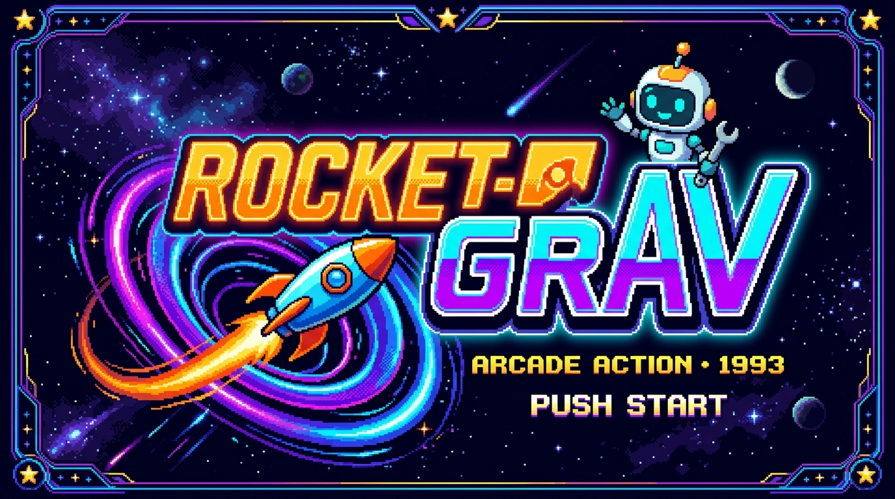
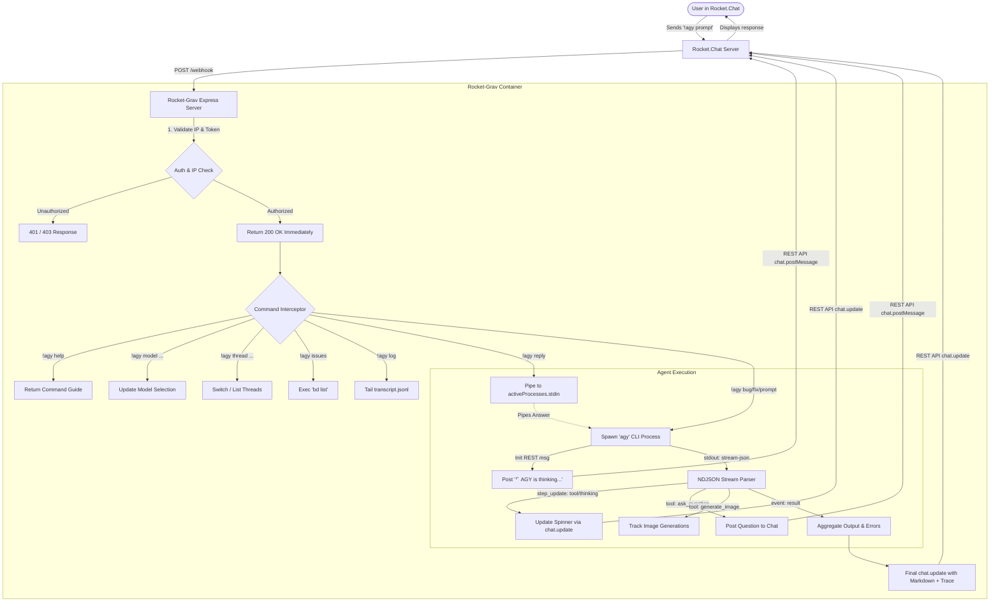

# <p align="center"></p>

<h1 align="center">Rocket-Grav</h1>

<p align="center">
  <strong>Autonomous Antigravity (AGY) Agent Bridge for Rocket.Chat</strong><br />
  <em>Interactive Pair-Programming & Task Execution straight from your chat channels.</em>
</p>

<p align="center">
  
</p>

<p align="center">
  
  
  
  
  
</p>

---

## 🚀 Overview

**Rocket-Grav** is a Dockerized integration bridge connecting [Rocket.Chat](https://rocket.chat) outgoing webhooks to Google's **Antigravity CLI** (`agy`). It enables teams and developers to interact directly with autonomous coding agents (`MangoBot`) from standard Rocket.Chat channels or threads.

### Key Capabilities

* **Real-time Live Status & Animated Spinners:** Streams CLI progress directly to chat via the Rocket.Chat REST API (`chat.update`), showing active tool executions, thinking steps, and file modifications in real time.
* **Interactive Reply Piping:** Intercepts agent interactive prompts (such as `ask_question` with multiple choices or confirmation requests) and pipes user answers directly into the running agent process (`stdin`).
* **Multi-Thread & Conversation Context:** Seamlessly isolates tasks across conversation threads. Resume work on existing contexts or spin up clean threads with a single command.
* **Dynamic Model Switching:** Switch underlying language models on the fly (Claude Opus/Sonnet, Gemini 3.1 Pro, Gemini 3.7 Flash, GPT-OSS) whenever quotas run low.
* **Built-in Issue Tracking (Beads):** Automatically converts chat requests starting with `bug`, `feature`, or `fix` into structured [Beads](https://github.com/steven-tey/beads) issues (`bd create`) scoped to the active epic thread.
* **Automatic Resiliency & Retry Logic:** Catches abrupt crashes and non-zero exit codes with automated 3-attempt retry loops, surfacing detailed JSON trace details when errors persist.
* **Image Asset Server & Cost Tracking:** Automatically tracks image generation calls and serves generated visual assets via a built-in static HTTP asset endpoint.

---

## 🏛️ Architectural Flow

Rocket-Grav acts as an intelligent intermediary between Rocket.Chat, the Antigravity agent process, and the host workspace.



### Execution Step Details

1. **Webhook Ingestion:** Rocket.Chat fires an outgoing webhook to `POST /webhook`.
2. **Security Verification:** The request client IP is filtered against allowed subnets and the payload token is matched against `ROCKETCHAT_TOKEN`. An empty HTTP `200` response is acknowledged instantly to prevent Rocket.Chat timeout warnings.
3. **Intent Parsing & Beads Interception:** If the prompt starts with `bug`, `feature`, `fix`, `add`, or `issue`, Rocket-Grav automatically invokes `bd create "[Epic: <thread>] <title>"` in the workspace.
4. **Process Spawning:** Spawns `agy` with `--output-format stream-json`, `--dangerously-skip-permissions`, the active `--conversation <uuid>` (if continuing a thread), and `--model <model>` (if switched).
5. **Real-Time Streaming:** The server inspects the NDJSON output stream, continuously updating the placeholder message with an animated Braille spinner (`⠋`, `⠙`, `⠹`...) and active status (e.g. `Running run_command...`).
6. **Interactive Interception:** When AGY calls the `ask_question` tool, Rocket-Grav extracts question text and multiple-choice options, posts them to chat, and waits for a `!agy reply <choice>` command which writes into the child's `stdin`.
7. **Final Delivery:** Updates the chat message with the final markdown response, appending raw JSON trace chunks on failures or GCP cost estimations on image creations.

---

## 💻 Usage Switches & Commands

All commands can be invoked in designated Rocket.Chat channels or threads using either the `!agy` prefix or `@agy` mention.

### 1. General Prompts & Tasks

| Command | Description | Example |
|---|---|---|
| `!agy <prompt>` | Sends a prompt or instruction to AGY in the active thread. | `!agy Refactor database connection pool in db.js` |
| `!agy help` | Displays the built-in help and command quick reference. | `!agy help` |

### 2. Issue Tracking (Beads)

Rocket-Grav natively pairs prompts with the `bd` (Beads) command-line issue tracker:

| Command | Description | Example |
|---|---|---|
| `!agy bug <desc>` | Logs a bug issue to Beads under the active thread epic, then executes AGY. | `!agy bug User avatar fails to load on 404 response` |
| `!agy feature <desc>` | Logs a feature request to Beads under the active thread epic, then executes AGY. | `!agy feature Add Prometheus metrics endpoint to API` |
| `!agy fix <desc>` | Logs a fix task to Beads under the active thread epic, then executes AGY. | `!agy fix Syntax error in auth middleware` |
| `!agy add <desc>` | Logs an addition task to Beads under the active thread epic, then executes AGY. | `!agy add Unit tests for payment webhook handler` |
| `!agy issues` / `!agy beads` | Lists all currently open Beads issues in the workspace. | `!agy issues` |

> [!NOTE]
> Issues are tracked in `/workspace/.beads` and remain open for your manual inspection and testing before being closed.

### 3. Interactive Replies

When AGY prompts for clarification or permission via `ask_question`:

```
**AGY has a question:**
*Do you want to proceed with database schema migration?*
  1. Yes, migrate now
  2. No, skip migration

*(Reply using `!agy reply <your answer>`)*
```

| Command | Description | Example |
|---|---|---|
| `!agy reply <answer>` | Pipes the answer into the active AGY process `stdin`. | `!agy reply 1` or `!agy reply yes` |
| `!agy answer <answer>` | Alias for `!agy reply`. | `!agy answer proceed` |

### 4. Model Switching

Dynamically adjust language models to navigate quota limits or optimize reasoning depth:

| Command | Description | Example |
|---|---|---|
| `!agy model` | Displays the currently selected model. | `!agy model` |
| `!agy models` / `!agy model list` | Displays the table of available models and shortcuts. | `!agy models` |
| `!agy model switch <name>` | Switches the model used for subsequent requests. | `!agy model switch claude` |
| `!agy model use <name>` | Alias for `model switch`. | `!agy model use flash` |

#### Available Model Shortcuts

| Shortcut | Target Model ID | Notes |
|---|---|---|
| `default` | *(none / subscription default)* | Resets to default Antigravity subscription plan |
| `claude` / `opus` | `claude-opus-4-6-thinking` | Claude Opus 4.6 with Thinking enabled |
| `sonnet` / `claude-sonnet` | `claude-sonnet-4-6` | Claude Sonnet 4.6 |
| `gemini` / `gemini-pro` | `gemini-3.1-pro-low` | Gemini 3.1 Pro (Low reasoning) |
| `gemini-pro-high` | `gemini-3.1-pro-high` | Gemini 3.1 Pro (High reasoning) |
| `flash` | `gemini-3.7-flash-medium` | Gemini 3.7 Flash (Medium reasoning) |
| `flash-high` | `gemini-3.7-flash-high` | Gemini 3.7 Flash (High reasoning) |
| `flash-low` | `gemini-3.7-flash-low` | Gemini 3.7 Flash (Low reasoning) |
| `gpt` | `gpt-oss-120b-medium` | GPT-OSS 120B (Medium reasoning) |
| `<custom-id>` | `<any raw model id>` | Pass any valid AGY model ID directly |

### 5. Thread & Context Management

Each conversation thread retains its own isolated AGY conversation UUID:

| Command | Description | Example |
|---|---|---|
| `!agy thread list` / `!agy threads` | Lists all available threads and highlights the currently active one. | `!agy threads` |
| `!agy thread switch <name>` | Switches the active context to an existing thread or creates a new one. | `!agy thread switch feature-auth` |
| `!agy thread checkout <name>` | Alias for `thread switch`. | `!agy thread checkout main` |

### 6. Diagnostics & Logs

| Command | Description | Example |
|---|---|---|
| `!agy log` / `!agy logs` | Fetches the last 25 lines of the active thread's raw `transcript.jsonl`. | `!agy log` |

### 7. External HTTP Endpoints

Rocket-Grav exposes the following HTTP endpoints on port `8080`:

* `POST /webhook`: Inbound webhook endpoint for Rocket.Chat and external automation agents.
  ```json
  {
    "token": "your_secure_token_here",
    "channel_id": "GENERAL",
    "text": "!agy check service health"
  }
  ```
* `GET /assets`: Interactive HTML gallery of generated images and assets.
* `GET /assets/:file`: Direct static file download of generated assets.

---

## 🐳 Docker Setup & Installation

### 1. Prerequisites

* Docker and Docker Compose (or Dockhand / Portainer stack manager).
* An accessible Rocket.Chat instance with administrative access.
* A Google account with Antigravity CLI access.

### 2. Required Environment Variables

Configure these variables in your `.env` file or stack manager:

| Variable | Required | Default | Description |
|---|---|---|---|
| `ROCKETCHAT_TOKEN` | **Yes** | — | Webhook security verification token. Must match the token configured in the Rocket.Chat Outgoing Webhook. |
| `ROCKETCHAT_USER_ID` | **Yes** | — | User ID of the Rocket.Chat bot account (e.g. `MangoBot`). Used for REST API calls. |
| `ROCKETCHAT_PAT` | **Yes** | — | Personal Access Token (PAT) for the bot user to authenticate with Rocket.Chat REST API (`chat.postMessage` / `chat.update`). |
| `ROCKETCHAT_URL` | **Yes** | `http://rocketchat.example.com:3000` | Base URL of your Rocket.Chat server (must be reachable from inside the container). |
| `GITEA_PAT` | Optional | — | Personal access token for automated Gitea Git repository operations. |
| `GEMINI_API` | Optional | — | Google AI / Gemini API key for external API tool calls or image generation. |

### 3. Volume Mounts

The container uses persistent host volume bindings:

```yaml
volumes:
  - ./workspace:/workspace                          # Working directory where AGY creates/edits code
  - ./.gemini:/root/.gemini                         # Persists Antigravity auth session and conversation memory
  - ./skills:/root/.gemini/antigravity-cli/skills   # Custom AGY skills folder
```

### 4. IP Whitelisting (`ipFilter`)

Rocket-Grav includes an embedded IP filter middleware (`server.js`) to protect the webhook endpoint from unauthorized networks. The default allowed IP patterns are:

* Local server IPs: `127.0.0.1`, `127.0.0.1`
* Domain host: `chat.example.com`
* Loopback: `127.0.0.1`, `::1`
* Docker container bridge networks: `172.x.x.x` (`::ffff:172.`)

> [!IMPORTANT]
> If your Rocket.Chat instance or external scripts call Rocket-Grav from a different IP subnet, be sure to update `ipFilter` in `server.js` before deploying.

---

## 🛠️ Step-by-Step Setup Guide

### Step 1: Clone the Repository

```bash
git clone http://git.example.com:3000/camkerr81/rocket-grav.git
cd rocket-grav
```

### Step 2: Create `.env` Configuration

Create a `.env` file in the root directory:

```env
ROCKETCHAT_TOKEN=your_webhook_token_here
ROCKETCHAT_USER_ID=qW8x9J2kL4mNpQrSt
ROCKETCHAT_PAT=your_personal_access_token
ROCKETCHAT_URL=http://rocketchat.example.com:3000
GEMINI_API=AIzaSy...
```

### Step 3: Build & Start Container

```bash
docker compose up -d --build
```

### Step 4: Perform One-Time Antigravity OAuth Authentication

Before the bridge can process autonomous prompts, complete the one-time Google authentication flow inside the container:

```bash
docker exec -it rocketchat-agy-bridge agy
```

1. The terminal will display an OAuth verification URL.
2. Open the URL in your browser and log in with your Google account.
3. Paste the authorization token back into the terminal if prompted.
4. Credentials will be securely saved into `./.gemini`, persisting permanently across container updates and restarts.

### Step 5: Configure Rocket.Chat Outgoing Webhook

1. Log into your Rocket.Chat instance as an Administrator.
2. Navigate to **Administration** ➔ **Workspace** ➔ **Integrations** ➔ **New Integration** ➔ **Outgoing WebHook**.
3. Fill in the integration settings:
   * **Event Trigger:** `Message Sent`
   * **Enabled:** `True`
   * **Name:** `MangoBot Bridge`
   * **Channel:** `#general` *(or leave blank for all channels)*
   * **Trigger Words:** `!agy`, `@agy`
   * **Target URLs:** `http://<bridge-host-ip>:8080/webhook`
   * **Token:** *(Paste the exact value defined in `ROCKETCHAT_TOKEN`)*
   * **Impersonate User:** `False`
4. Click **Save Changes**.

### Step 6: Create Bot User & Personal Access Token (PAT)

1. Navigate to **Administration** ➔ **Users** ➔ **Add User**.
2. Create a user with Username `MangoBot` and Role `bot` or `user`.
3. Log in as `MangoBot` (or use Admin impersonation).
4. Go to **My Account** ➔ **Personal Access Tokens**.
5. Generate a new token with name `rocket-grav-bridge`.
6. Copy the generated Token into `ROCKETCHAT_PAT` and the User ID into `ROCKETCHAT_USER_ID`.

### Step 7: Test the Integration

In any Rocket.Chat channel where the bot has access, type:

```text
!agy help
```

MangoBot will respond immediately with the command guide!

---

## 📁 Repository Structure

```text
rocket-grav/
├── bin/
│   └── bd                       # Bundled Beads issue tracker Linux binary
├── docs/
│   └── images/
│       ├── icon.png             # 16-bit retro app icon
│       └── logo.png             # 16-bit retro banner logo
├── .gemini/                     # Persisted Antigravity session & rules (volume mounted)
│   └── antigravity-cli/
│       └── rules/
│           └── beads_testing.md # Global rule preventing auto-closure of Beads bugs
├── skills/                      # Custom AGY skills folder (volume mounted)
├── workspace/                   # Target workspace folder where AGY operates
├── Dockerfile                   # Debian 12 (Bookworm) container build definition
├── docker-compose.yml           # Stack deployment configuration
├── package.json                 # Express and Node.js dependencies
├── server.js                    # Webhook server, stream parser & process manager
└── README.md                    # Comprehensive documentation
```

---

## 🛡️ License

Internal project for autonomous development workflows with Rocket.Chat and Google Antigravity.
All rights reserved.
